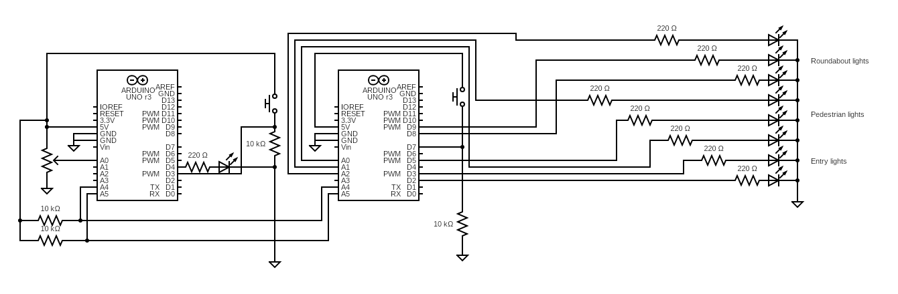

# Control of Traffic Lights at a Roundabout

This was an academic project for the course **Aplications and Computation for the IoT**.
[Project description]()

---

This project’s main goal is to implement a modular and automatic traffic lights system for a roundabout, using **Arduino Uno** and led lights to mimic a real-world system. there will be a central controller that manages the             different lights' controllers via the **I2C** protocol.

